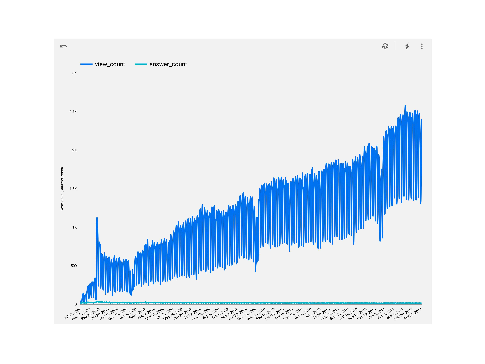

# BigQuery and Cloud

### By Philip Kendall

#### This project utilizes BigQuery, BigQuery Python client library, and SQL to create and manipulate data in various ways.
## Technologies Used

* GIT
* BigQuery CLI
* BigQuery Python client library
* Google SQL
* Jupyter Notebooks

## Description

The BigQuery CLI is used to crate a dataset called 'plants'. A BigQuery client is then created using Python which is then utilized to list, and make sure it has been created. SQL is then used in BigQuery, which has been stored in the main.sql file, to create and seed values into a new table called 'flower_shop'. The Python client is used again to list that new table.

For the visualization that I generated in Looker Studio, I utilized a StackOverflow dataset and created a visualization that showed and compared the total view and answer count over a period of time from around 2008 to 2011.

## Setup/Installation Requirements

* Fork over the the repository to your own Github account.
* Clone your Github repo down to your local machine and into the directory you would like this project to be stored.
* Navigate to the main.ipynb and main.sql file and open it in your text editor.
* Install the requirements.txt file
* After that, the project should be able to run.

## Known Bugs

N/A

## License

Permission is hereby granted, free of charge, to any person obtaining
a copy of this software and associated documentation files (the
"Software"), to deal in the Software without restriction, including
without limitation the rights to use, copy, modify, merge, publish,
distribute, sublicense, and/or sell copies of the Software, and to
permit persons to whom the Software is furnished to do so, subject to
the following conditions:

The below copyright notice and this permission notice shall be
included in all copies or substantial portions of the Software.

THE SOFTWARE IS PROVIDED "AS IS", WITHOUT WARRANTY OF ANY KIND,
EXPRESS OR IMPLIED, INCLUDING BUT NOT LIMITED TO THE WARRANTIES OF
MERCHANTABILITY, FITNESS FOR A PARTICULAR PURPOSE AND
NONINFRINGEMENT. IN NO EVENT SHALL THE AUTHORS OR COPYRIGHT HOLDERS BE
LIABLE FOR ANY CLAIM, DAMAGES OR OTHER LIABILITY, WHETHER IN AN ACTION
OF CONTRACT, TORT OR OTHERWISE, ARISING FROM, OUT OF OR IN CONNECTION
WITH THE SOFTWARE OR THE USE OR OTHER DEALINGS IN THE SOFTWARE.

Copyright (c) 2023 Philip Kendall